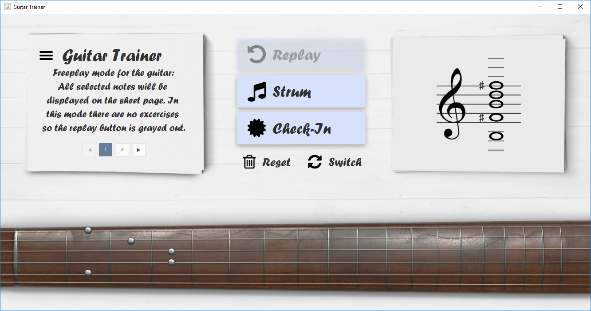
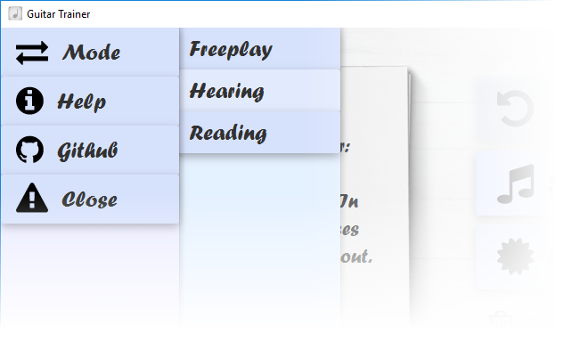
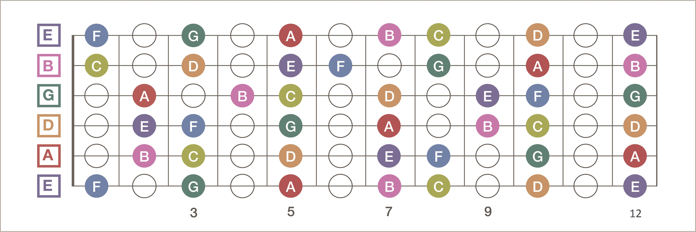

# GuitarTrainer: 
A program that trains you to recognize heard notes / chords. There are be four modes available:
- hearing a note and selecting it on the fretboard and the sheets
- translating a sheet note to the possible positions on the fretboard
- translating a position on the fretboard to a sheet note
- freeplay (clicking on the either sheets or fretboard updates both)

Build: [GuitarTrainer2.0](https://www.dropbox.com/s/f7b4vtv5wjefqzd/GuitarTrainer_2.0.jar?dl=0)

## Gui
### Main Window

### Mode selection

## Help
### Fretboard 

### Chromatic Circle

### Open strings as sheet notes 

## Links
- [MIDI-Converter](https://www.zamzar.com/)
- [Note reading excercises](https://www.bonedo.de/artikel/einzelansicht/noten-lesen-lernen-fuer-gitarristen-1-das-notensystem-grundlagen-und-leersaitenspiel.html)
- [Note reading lesson](https://www.youtube.com/watch?v=8Mj6305Rr2w&t=418s)
- [Uml-Editor](http://www.umlet.com/umletino/umletino.html)
- [Octave summary](http://www.musikkunde.info/notenlehre/oktavraeume)
- [Fontflipper](https://fontflipper.com/flip-or-flop)

---

### Todo: near-tearm
- implement file exists check in AudioConverter
- make programm resizable in width
- Update check in messages
- delete todos in src
- change exercise pack output to input stream -> make it compatible with a .jar release

### Todo: itermediate-term
- write / display helping screen
- make drawer background transparent (initModeDrawerStack, etc.)

### Todo: long-term
- update UML Diagram 
- take out function in main class to prevent exception shutdown

