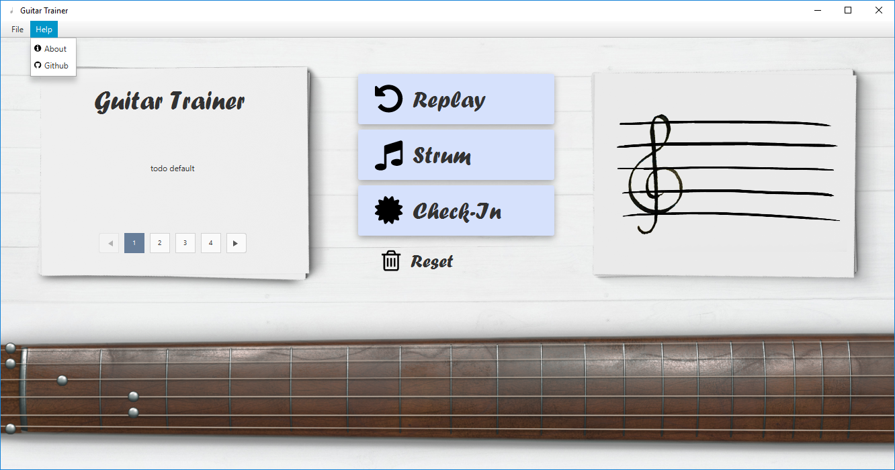

# GuitarTrainer: 
A program that trains you to recognize heard notes / chords. There will be three modes where the notes can be selected on:
- a virtual fretboard from a guitar
- a tableau in the standard guitar format
- a classical note scale

### Gui (WIP)

### UML-Diagram

## Help
### Fretboard 

### Chromatic Circle

## Links
- [MIDI-Converter](https://www.zamzar.com/)
- [Note reading excercises](https://www.bonedo.de/artikel/einzelansicht/noten-lesen-lernen-fuer-gitarristen-1-das-notensystem-grundlagen-und-leersaitenspiel.html)
- [Note reading lesson](https://www.youtube.com/watch?v=8Mj6305Rr2w&t=418s)
- [Uml-Editor](http://www.umlet.com/umletino/umletino.html)
- [Octave summary](http://www.musikkunde.info/notenlehre/oktavraeume)
- [Fontflipper](https://fontflipper.com/flip-or-flop)

---

### Todo: near-tearm
- update UML Diagram 
- cut height from fretboard texture
- merge feature branch with master
- Gui Menu (including icons)

### Todo: itermediate-term
- `inc / decOctave`: Implementation, Tests 
- Javadoc
- test project with Checkstyle

### Todo: long-term
- Implement Excercise mode
