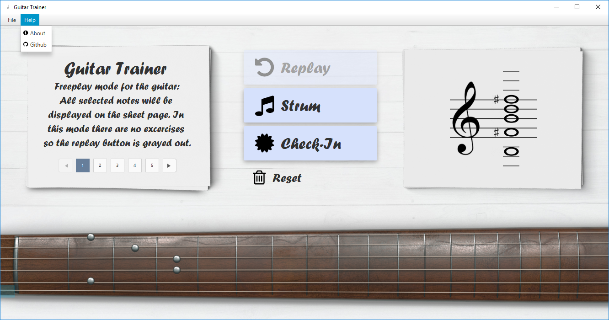

# GuitarTrainer: 
A program that trains you to recognize heard notes / chords. There will be four modes:
- hearing a note and selecting it on the fretboard and the sheets
- translating a sheet note to the possible positions on the fretboard
- translating a position on the fretboard to a sheet note
- freeplay (clicking on the either sheets or fretboard updates both)

Build: [GuitarTrainer1.0](otherDocs/build/GuitarTrainer1.0.jar)

### Gui (WIP)

## Help
### Fretboard 

### Chromatic Circle

### Open strings as sheet notes 

## Links
- [MIDI-Converter](https://www.zamzar.com/)
- [Note reading excercises](https://www.bonedo.de/artikel/einzelansicht/noten-lesen-lernen-fuer-gitarristen-1-das-notensystem-grundlagen-und-leersaitenspiel.html)
- [Note reading lesson](https://www.youtube.com/watch?v=8Mj6305Rr2w&t=418s)
- [Uml-Editor](http://www.umlet.com/umletino/umletino.html)
- [Octave summary](http://www.musikkunde.info/notenlehre/oktavraeume)
- [Fontflipper](https://fontflipper.com/flip-or-flop)

---

### Todo: near-tearm
- tidy up fretboard controller
- modify Runner class with delay time

### Todo: itermediate-term
- write / display helping screen
- maybe add image header in menu

### Todo: long-term
- make programm resizable in width
- update UML Diagram 

